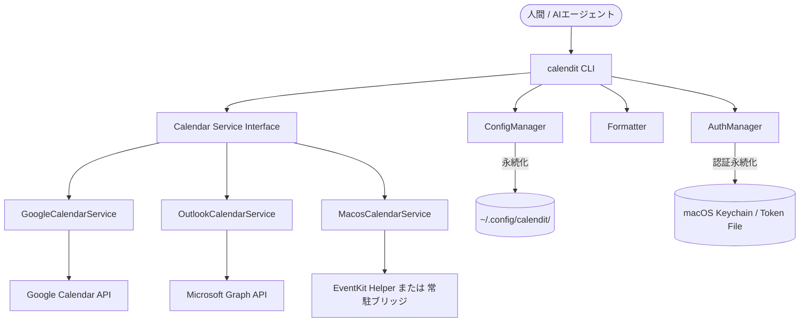

# カレンダー操作CLIツール `calendit` 仕様書 (最新版)

## バージョン管理
- **現在のバージョン**: `2026.4.26` (Beta) — 製品表記。npm の `package.json#version` は [semver](https://semver.org/) 準拠
- **最終更新日**: 2026-04-24

---

## 1. 概要
`calendit` は、ターミナルから Google カレンダー、Outlook カレンダー、および **macOS 標準カレンダー（EventKit）** の予定を照会・登録・操作するためのコマンドラインツールです。
特に、**LLM（AIエージェント）による自動操作**と、**人間によるドキュメントベースの管理**の両立を目的としています。

### システム構造


## 2. 主要機能
### 2.1 認証・アカウント接続状態 (Auth / Accounts)
- **方式（Google / Outlook）**: 各サービスが提供する標準的な OAuth 2.0 Web Flow。
- **`calendit accounts status`**: 登録済みコンテキストごとに、サービス・カレンダー・アカウント表示名・**接続状態**（`CONNECTION` 列。Google/Outlook はトークン相当、macOS は TCC 経路と eventkit-helper / ブリッジのいずれで `doctor` が通ったか・`calendarIdentifier` の存在）を一覧表示する。macOS でブリッジ経由のときは **`OK (bridge)`** を表示し得る。`CALENDAR NOT FOUND` は主に ID 不整合。`NO CALENDAR ACCESS` は TCC/トランスポート系（カレンダー ID 自体の誤りと混同しやすい）を指す。macOS 行の **`ACCOUNT` 列**は `calendit macos list-calendars` の **SOURCE**（EventKit の `sourceTitle`）と同一の値を表示する（カレンダー未検出時は従来どおり `accountId` または `(default)`）。
- **`calendit auth status`**: `accounts status` と同一形式の表を出力する。将来的には `accounts` への統合を推奨する案内をログに表示する場合がある。
- **Google**: トークンファイルの有効期限・`refresh_token` の有無で `OK` / `NOT LOGGED IN` / `EXPIRED` / `NOT CONFIGURED` を判定する。
- **Outlook**: `config.json` に `outlook_creds` が無い場合は **`NOT CONFIGURED`**。設定済みなら MSAL キャッシュ上のアカウント照合で `OK` / `NOT LOGGED IN` 等を判定する。
- **macOS（EventKit）**: OAuth は不要。**既定**: macOS 上で `CALENDIT_EVENTKIT_BRIDGE` 未指定のとき、**`bridge.token` と有効な Unix ソケット**が `~/Library/Application Support/calendit/`（または `CALENDIT_CONFIG_DIR` 使用時はその下）に存在すれば **常駐ブリッジ**を自動使用。`CALENDIT_EVENTKIT_BRIDGE=0` 等で **eventkit-helper** 子プロセスに固定可。`config set-macos-transport` により、シェル未設定時の既定（`auto` / `bridge` / `helper`）を `config.json` に永続可。TCC 許可の主体は原則 **CalenditEventKitBridge.app** 側（`calendit macos bridge start` / `macos setup` 参照）。いずれも `calendarIdentifier` の存在等で接続を判定する（詳細は `docs/eventkit-bridge.md`）。
- **macOS（参加者）**: `add --attendees` 等で渡した参加者を EventKit 経由で確実に書き戻すことは、Swift / EventKit 側の挙動・権限の整理が未スパイクのため現時点では保証しない（今後の検証課題）。
- **体験**: コマンド実行時にブラウザが開き、ユーザーがログイン・許可を行うと、ローカルの `calendit` がトークンを取得・保存します。
- **保存と永続化 (macOS重視)**: 
  - 認証トークンは OS の安全な場所（**macOS キーチェーン**）に保存されます。
  - `offline_access` スコープを要求することで「リフレッシュトークン」を取得し、二回目以降はバックグラウンドで自動的に認証を更新します。
  - これにより、企業ポリシー等でブラウザのセッションが頻繁に切れる場合でも、**macOS 標準カレンダー同様の「ログイン状態の永続化」**を実現します。

### 2.2 カレンダー・予定操作 (CRUD)
#### イベント（予定）の操作
- **既存の予定の照会・追加・編集・削除**: 
  - 本ツール以外（Google純正アプリ、macOSカレンダー等）で作成された予定であっても、各サービスが発行する `id` をキーにして、本ツールから自由に操作可能です。
  - `apply` コマンド実行時に、ファイル内に `id` が記載されていれば既存予定を更新、なければ新規作成します。

#### カレンダー（フォルダ）自体の操作
- `calendit cal list`: 認証アカウント内の全カレンダー（サブカレンダー含む）を表示。
- `calendit cal add <name>`: 新しいカレンダーを作成。
- `calendit cal edit <id> --name <new_name>`: カレンダー名を変更。
- `calendit cal delete <id>`: カレンダーを削除（※安全性に注意）。

### 2.3 バルク操作 (Bulk Operations) ※重要
- **一括登録**: ファイル（CSV/MD/JSON）に記載された複数の予定を一度に登録。
- **一括リスケジュール**: 既存の予定を含むリストを読み込み、ID をキーにして一括で更新。

### 2.4 安全性の担保 (Safety Mode)
意図しない一括削除やカレンダーの削除を防ぐため、以下の仕組みを導入しています。
1.  **Dry Run モード (`--dry-run`)**: 実際の API 呼び出しを行わず、変更内容を事前にプレビューします。
2.  **確認プロンプト**: 破壊的操作の実行前にユーザー確認を促します。(`--force` でスキップ可能)
3.  **プライマリカレンダーの保護**: メインカレンダー自体の削除を制限します。
4.  **日付跨ぎ予定の自動処理**: `22:00 - 02:00` のような日付を跨ぐ予定について、入力が時刻のみの場合は自動的に「翌日の午前中」として扱い、正しく登録します。

### 2.5 多彩な入出力フォーマット
- **CSV**: 表形式で一覧性が高く、データ処理に適しています。
- **Markdown (MD)**: 人間の視認性が高く、メモ帳感覚で編集・管理できます。
- **JSON (CalendarJSON)**: AI ツールがプログラム的に処理するのに最適な標準化フォーマット。メタデータ付きラッパー形式（詳細は §3.3）。

### 2.6 UI 言語（ローカライズ）
- **既定**: 英語（`en`）。ユーザー向け文言は `src/locales/en.json` / `ja.json` をマスターとし、実行時に `t()` で解決する。
- **優先順位**: 環境変数 `CALENDIT_LOCALE` > グローバル `--locale <code>` > `config.json` の `ui.locale`（未設定時は `en`）。
- **初回**: `config.json` がまだない場合のみ、対話で言語を選択し、`ui` に保存する（テスト・CI・非TTY・`CALENDIT_SKIP_LOCALE_PROMPT=1`・`CALENDIT_MOCK=true` ではスキップ）。
- **永続変更**: `calendit config set-locale en|ja`。

### 2.7 エラー表示とログ（診断）
- **ユーザー向け**: 終了コード 1 の失敗時も、原則として **`t()` による短いメッセージ**と、あれば **`hint`** の 1〜2 行のみを標準出力に出す（機密や API 生データは載せない）。
- **`--verbose`**: デバッグログを有効化し、スタックトレース等の追加診断を出す場合がある。
- **`DEBUG=calendit`**: ログレベルを `debug` に上げる。失敗時は **`ErrorMeta`** 名の 1 行 JSON（エラー種別・`causeCode`・API 要約など）を **`logger.debug`** で出し、非 verbose 実行でも診断に使える。
- **`--debug-dump <file>`**: ユーザー向け行とログ行の双方を指定ファイルへ追記する（ファイルパスはユーザーが管理する）。

---

## 3. データ仕様
各サービス（Google/Outlook）の差分を吸収し、共通のフォーマットで扱います。

### 3.1 共通イベントモデル
| フィールド名 | 説明 | 備考 |
| :--- | :--- | :--- |
| `id` | カレンダーサービス側で発行される一意のID | |
| `summary` | 予定のタイトル | |
| `start` | 開始日時 (ISO 8601形式) | 例: `2024-04-12T10:00:00+09:00` |
| `end` | 終了日時 (ISO 8601形式) | |
| `location` | 場所 | |
| `description`| 説明・メモ | |
| `service` | `google` / `outlook` / `macos` | |
| `calendar_id`| 対象カレンダーのID | |

### 3.2 CalendarJSON フォーマット（標準化 JSON 形式）

`query --format json` の出力および `apply` の JSON 入力に使用する公式スキーマ。AI が読み書きしやすいメタデータ付きのラッパー形式。

```json
{
  "version": "1",
  "generated_at": "2026-04-16T10:00:00+09:00",
  "context": "work",
  "service": "google",
  "calendar_id": "primary",
  "events": [
    {
      "id": "g_abc123",
      "summary": "ミーティング",
      "start": "2026-04-16T10:00:00+09:00",
      "end": "2026-04-16T11:00:00+09:00",
      "location": "会議室A",
      "description": "週次定例",
      "service": "google",
      "calendar_id": "primary"
    }
  ]
}
```

| フィールド | 必須 | 説明 |
| :--- | :--- | :--- |
| `version` | ○ | スキーマバージョン（現在 `"1"`） |
| `generated_at` | ○ | 生成日時（ISO 8601） |
| `context` | - | 生成時のコンテキスト名 |
| `service` | - | `google` / `outlook` / `macos` |
| `calendar_id` | - | 対象カレンダーの ID |
| `events` | ○ | イベント配列 |

- **後方互換**: イベントの plain array 形式も `apply` で受け入れるが、警告を表示する。
- **スキーマ検証**: `apply` 入力時に zod で検証し、不正な形式は `ValidationError` を返す。

### 3.3 IDの扱い
- **MD出力時**: 人間が視認・管理しやすくするため、予定の末尾に `(ID: ...)` 形式で記載します。
  - 例: `- [ ] **ミーティング** (10:00-11:00) (ID: g_abc123)`
- **CSV/JSON出力時**: 明示的な列/フィールドとして保持します。

---

## 4. コンテキスト設定 (Contexts)
用途に応じた設定をプリセットとして保持し、コマンドのオプション (`--set work` 等) で切り替え可能です。
- **設定項目**: 対象カレンダーID（Google/Outlook の API ID、macOS の場合は EventKit の **`calendarIdentifier`**）、デフォルトフォーマット、表示項目など。
- **コンテキスト別認証**: Google/Outlook では各コンテキストに個別アカウント（認証トークン）を紐づけられる。macOS コンテキストは OS ユーザーに紐づくローカルカレンダーを指す。

## 5. 高度な同期ロジック
同期操作 (`apply`) 時、利便性と安全性を高める以下のロジックが適用されます。
1.  **期間の自動検知**: 入力ファイル内のイベントから自動的に同期対象期間（最小〜最大日）を判別し、その範囲内で差分更新（`--sync` 時は同期削除）を行います。
2.  **空ファイル保護**: 同期範囲が特定できない（入力が空の）場合、意図しない全削除を防ぐため、実行を安全にスキップします。
3.  **相対期間指定**: 引数において `7d` (7日間), `14d` (2週間), `1m` (30日間) といった相対指定を受け付けます。
4.  **入力バリデーション**: 時刻の逆転（開始 > 終了）や同一ファイル内の ID 重複を検知し、データ破壊を防ぐガードレール機能を搭載。
5.  **プライマリ保護**: 重要なカレンダー（primary）に対する削除操作を制限。
6.  **双方向説明文同期**: Markdown のインデント行を説明文としてカレンダーに反映可能。
7.  **自律的テスト基盤 (`npm test`)**: Google/Outlook を中心に機能互換性を自動検証する基盤を搭載。`CALENDIT_TEST_CONTEXT` 環境変数により、特定のプロバイダに絞った互換性テストを容易に実行可能です。

---

## 5. CLI コマンド体系

### 基本・カレンダー管理
- `calendit auth login <google|outlook>`
- `calendit accounts status`（全コンテキストの接続状態）
- `calendit auth status`（上記と同一出力。`accounts` 利用を推奨する案内あり）
- `calendit macos doctor` / `calendit macos list-calendars`（EventKit 診断・カレンダー一覧）/ `calendit macos bridge fetch`（GitHub 取得→`fetched-eventkit-bridge`、**確認プロンプト**＋任意 Swift ビルド）/ `calendit macos bridge start` / `calendit macos bridge build`（`bridge fetch` 後、または `native/eventkit-bridge` を同梱/参照できる場合。npm 単体には同梱されない）/ `calendit macos setup`
- `calendit cal list`
- `calendit cal add <name>`

### 予定の照会・適用 (メイン)
- `calendit query --set work --out-md schedule.md`
- `calendit apply --in-md schedule.md [--dry-run] [--sync]`
  - `--sync` オプションを付けると、ファイルに記載されていない既存の予定をカレンダーから削除し、ファイルの内容と完全に同期させます。
- `calendit add --summary "ランチ" --start "12:00" [--location "場所"] [--dry-run]`
  - `--start "tomorrow 11:00"` や `today 11:00` といったキーワード指定も可能です。

---

## 6. 対応環境
- **OS**: macOS
- **ランタイム**: Node.js v18以上
