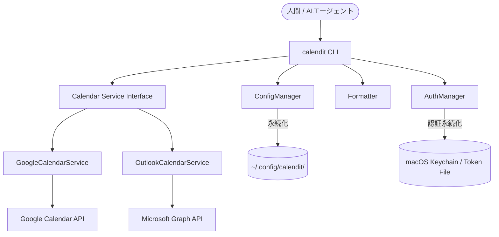

# カレンダー操作CLIツール `calendit` 仕様書 (最新版)

## バージョン管理
- **現在のバージョン**: `2026-0416-01.02` (Beta)
- **最終更新日**: 2026-04-16

---

## 1. 概要
`calendit` は、ターミナルから Google カレンダーおよび Outlook カレンダーの予定を照会・登録・操作するためのコマンドラインツールです。
特に、**LLM（AIエージェント）による自動操作**と、**人間によるドキュメントベースの管理**の両立を目的としています。

### システム構造

## 2. 主要機能
### 2.1 認証 (Auth)
- **方式**: 各サービスが提供する標準的な OAuth 2.0 Web Flow。
- **体験**: コマンド実行時にブラウザが開き、ユーザーがログイン・許可を行うと、ローカルの `calendit` がトークンを取得・保存します。
- **保存と永続化 (macOS重視)**: 
  - 認証トークンは OS の安全な場所（**macOS キーチェーン**）に保存されます。
  - `offline_access` スコープを要求することで「リフレッシュトークン」を取得し、二回目以降はバックグラウンドで自動的に認証を更新します。
  - これにより、企業ポリシー等でブラウザのセッションが頻繁に切れる場合でも、**macOS 標準カレンダー同様の「ログイン状態の永続化」**を実現します。

### 2.2 カレンダー・予定操作 (CRUD)
#### イベント（予定）の操作
- **既存の予定の照会・追加・編集・削除**: 
  - 本ツール以外（Google純正アプリ、macOSカレンダー等）で作成された予定であっても、各サービスが発行する `id` をキーにして、本ツールから自由に操作可能です。
  - `apply` コマンド実行時に、ファイル内に `id` が記載されていれば既存予定を更新、なければ新規作成します。

#### カレンダー（フォルダ）自体の操作
- `calendit cal list`: 認証アカウント内の全カレンダー（サブカレンダー含む）を表示。
- `calendit cal add <name>`: 新しいカレンダーを作成。
- `calendit cal edit <id> --name <new_name>`: カレンダー名を変更。
- `calendit cal delete <id>`: カレンダーを削除（※安全性に注意）。

### 2.3 バルク操作 (Bulk Operations) ※重要
- **一括登録**: ファイル（CSV/MD/JSON）に記載された複数の予定を一度に登録。
- **一括リスケジュール**: 既存の予定を含むリストを読み込み、ID をキーにして一括で更新。

### 2.4 安全性の担保 (Safety Mode)
意図しない一括削除やカレンダーの削除を防ぐため、以下の仕組みを導入しています。
1.  **Dry Run モード (`--dry-run`)**: 実際の API 呼び出しを行わず、変更内容を事前にプレビューします。
2.  **確認プロンプト**: 破壊的操作の実行前にユーザー確認を促します。(`--force` でスキップ可能)
3.  **プライマリカレンダーの保護**: メインカレンダー自体の削除を制限します。
4.  **日付跨ぎ予定の自動処理**: `22:00 - 02:00` のような日付を跨ぐ予定について、入力が時刻のみの場合は自動的に「翌日の午前中」として扱い、正しく登録します。

### 2.5 多彩な入出力フォーマット
- **CSV**: 表形式で一覧性が高く、データ処理に適しています。
- **Markdown (MD)**: 人間の視認性が高く、メモ帳感覚で編集・管理できます。
- **JSON**: AI ツールがプログラム的に処理するのに最適です。

---

## 3. データ仕様
各サービス（Google/Outlook）の差分を吸収し、共通のフォーマットで扱います。

### 3.1 共通イベントモデル
| フィールド名 | 説明 | 備考 |
| :--- | :--- | :--- |
| `id` | カレンダーサービス側で発行される一意のID | |
| `summary` | 予定のタイトル | |
| `start` | 開始日時 (ISO 8601形式) | 例: `2024-04-12T10:00:00+09:00` |
| `end` | 終了日時 (ISO 8601形式) | |
| `location` | 場所 | |
| `description`| 説明・メモ | |
| `service` | `google` または `outlook` | |
| `calendar_id`| 対象カレンダーのID | |

### 3.2 IDの扱い
- **MD出力時**: 人間が視認・管理しやすくするため、予定の末尾に `(ID: ...)` 形式で記載します。
  - 例: `- [ ] **ミーティング** (10:00-11:00) (ID: g_abc123)`
- **CSV/JSON出力時**: 明示的な列/フィールドとして保持します。

---

## 4. コンテキスト設定 (Contexts)
用途に応じた設定をプリセットとして保持し、コマンドのオプション (`--set work` 等) で切り替え可能です。
- **設定項目**: 対象カレンダーID、デフォルトフォーマット、表示項目など。
- **コンテキスト別認証**: 各コンテキストに個別の Google/Outlook アカウント（認証トークン）を紐づけることができます。

## 5. 高度な同期ロジック
同期操作 (`apply`) 時、利便性と安全性を高める以下のロジックが適用されます。
1.  **期間の自動検知**: 入力ファイル内のイベントから自動的に同期対象期間（最小〜最大日）を判別し、その範囲内で差分更新（`--sync` 時は同期削除）を行います。
2.  **空ファイル保護**: 同期範囲が特定できない（入力が空の）場合、意図しない全削除を防ぐため、実行を安全にスキップします。
3.  **相対期間指定**: 引数において `7d` (7日間), `14d` (2週間), `1m` (30日間) といった相対指定を受け付けます。
4.  **入力バリデーション**: 時刻の逆転（開始 > 終了）や同一ファイル内の ID 重複を検知し、データ破壊を防ぐガードレール機能を搭載。
5.  **プライマリ保護**: 重要なカレンダー（primary）に対する削除操作を制限。
6.  **双方向説明文同期**: Markdown のインデント行を説明文としてカレンダーに反映可能。
7.  **自律的テスト基盤 (`npm test`)**: 全プロバイダ（Google/Outlook）に対する機能互換性を自動検証する基盤を搭載。`CALENDIT_TEST_CONTEXT` 環境変数により、特定のプロバイダに絞った互換性テストを容易に実行可能です。

---

## 5. CLI コマンド体系

### 基本・カレンダー管理
- `calendit auth login <google|outlook>`
- `calendit cal list`
- `calendit cal add <name>`

### 予定の照会・適用 (メイン)
- `calendit query --set work --out-md schedule.md`
- `calendit apply --in-md schedule.md [--dry-run] [--sync]`
  - `--sync` オプションを付けると、ファイルに記載されていない既存の予定をカレンダーから削除し、ファイルの内容と完全に同期させます。
- `calendit add --summary "ランチ" --start "12:00" [--location "場所"] [--dry-run]`
  - `--start "tomorrow 11:00"` や `today 11:00` といったキーワード指定も可能です。

---

## 6. 対応環境
- **OS**: macOS
- **ランタイム**: Node.js v18以上
